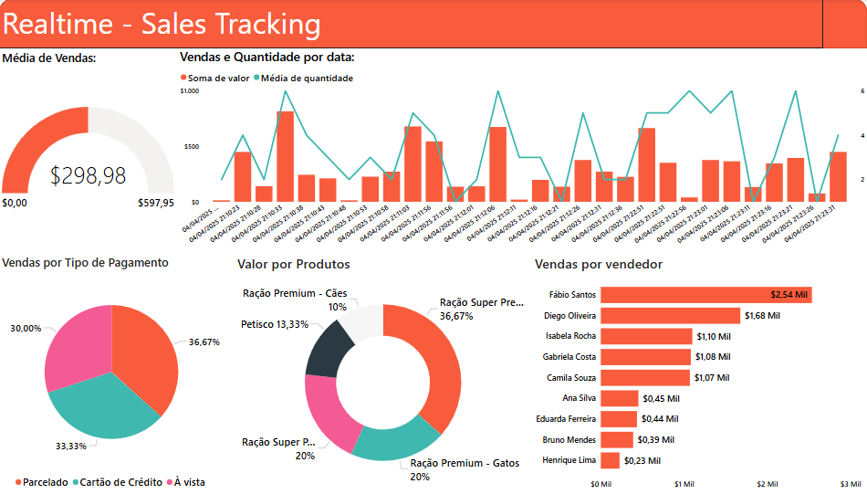
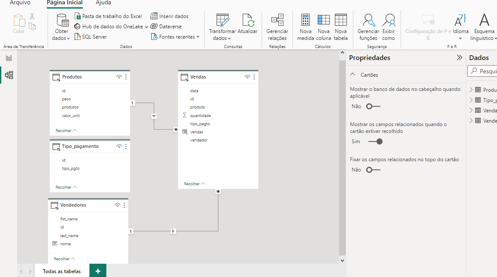

# 📊 Real-Time Sales Dashboard

Um dashboard interativo desenvolvido em Power BI para monitoramento de vendas em tempo real, com simulação de dados usando PostgreSQL.

## 🎯 Sobre o Projeto

Este projeto demonstra a criação de um sistema completo de Business Intelligence para acompanhamento de vendas em tempo real. O sistema simula transações de vendas de produtos pet e apresenta os dados através de um dashboard interativo no Power BI.

## ✨ Funcionalidades

- 📈 **Monitoramento em Tempo Real**: Atualização automática de dados de vendas
- 💰 **Métricas de Performance**: Média de vendas, variações e totais
- 📊 **Análise Multidimensional**: 
  - Vendas por período temporal
  - Distribuição por tipo de pagamento
  - Performance por vendedor
  - Análise por produto 
- 🔄 **Simulação Realística**: Script automatizado para geração de dados

## 🏗️ Arquitetura do Sistema

```
📁 Sales_Real_Time/
├── 🗄️ database/
│   └── RealTimeSimulation_PostgreSQL.sql
├── 📊 powerbi/
│   └── RealTime_Simulation_2.pbix
├── 📸 screenshots/
│   ├── PowerBI_2.png
│   └── PowerBI_Tabelas.png
└── 🎥 video/
    └── Real_time_sales_PWBI.mp4
```

## 🛠️ Tecnologias Utilizadas

- **Power BI**: Criação do dashboard e visualizações
- **PostgreSQL**: Banco de dados e simulação de dados em tempo real
- **SQL**: Scripts de simulação e manipulação de dados

## 📊 Modelo de Dados

O sistema utiliza um modelo relacional com 4 tabelas principais:

### 🏪 Tabelas
- **Produtos**: Catálogo de produtos com preços
- **Vendedores**: Informações da equipe de vendas
- **Tipo_pagamento**: Formas de pagamento disponíveis
- **Vendas**: Transações realizadas (tabela fato)

### 🔗 Relacionamentos
- Vendas ← → Produtos (1:N)
- Vendas ← → Vendedores (1:N)
- Vendas ← → Tipo_pagamento (1:N)

## 🚀 Como Executar

### Pré-requisitos
- PostgreSQL instalado
- Power BI Desktop
- Acesso ao banco de dados PostgreSQL

### 1. Configuração do Banco de Dados
```sql
-- Execute o script de simulação
\i database/RealTimeSimulation_PostgreSQL.sql
```

### 2. Configuração do Power BI
1. Abra o arquivo `powerbi/RealTime_Simulation_2.pbix`
2. Configure a conexão com seu banco PostgreSQL
3. Atualize os dados para visualizar o dashboard

### 3. Executar Simulação
O script SQL gera automaticamente:
- 10 transações de venda
- Intervalos de 5 segundos entre cada transação
- Dados aleatórios realísticos

## 📈 Dashboard - Principais Métricas

### KPIs Principais
- **Média de Vendas**: $298,98
- **Variação**: $597,95
- **Acompanhamento temporal** de vendas e quantidades

### Análises Disponíveis

#### 💳 Vendas por Tipo de Pagamento
- Parcelado: 36,67%
- Cartão de Crédito: 33,33%
- À Vista: 30,00%

#### 🛍️ Valor por Produtos
- Ração Super Premium: 36,67%
- Ração Premium - Gatos: 20%
- Petisco: 13,33%
- Ração Premium - Cães: 10%

#### 🏆 Top Vendedores
1. Fábio Santos: $2,54M
2. Diego Oliveira: $1,68M
3. Isabella Rocha: $1,10M
4. Gabriela Costa: $1,08M
5. Camila Souza: $1,07M

## 🎥 Demonstração

Confira o vídeo de demonstração do dashboard em funcionamento:

[https://github.com/user-attachments/assets/your-video-id-here](https://github.com/user-attachments/assets/812e7f82-009e-40d5-8749-c292f05c96dd)

> **Nota**: O vídeo mostra o dashboard em tempo real, incluindo a atualização automática dos dados e todas as funcionalidades interativas.

## 📸 Screenshots

### Dashboard Principal


### Modelo de Dados


## 🔧 Personalização

### Modificar Simulação
Para personalizar a simulação, edite o arquivo `database/RealTimeSimulation_PostgreSQL.sql`:
- Altere o número de transações (linha 12: `FOR v_i IN 1..10 LOOP`)
- Modifique o intervalo entre vendas (linha 32: `PERFORM pg_sleep(5)`)
- Ajuste os ranges de dados aleatórios

### Customizar Dashboard
- Adicione novos visuais no Power BI
- Crie novas medidas DAX
- Implemente filtros adicionais

## 📋 Funcionalidades do Script SQL

```sql
-- Características principais:
- Geração de IDs únicos aleatórios
- Timestamps em tempo real
- Seleção aleatória de produtos, vendedores e tipos de pagamento
- Cálculo automático de valores baseado no preço unitário
- Commit individual por transação
- Logging de progresso
- Pausa configurável entre inserções
```

## 🤝 Contribuições

Contribuições são bem-vindas! Sinta-se à vontade para:
- Reportar bugs
- Sugerir melhorias
- Adicionar novas funcionalidades
- Melhorar a documentação

## 📄 Licença

Este projeto está sob a licença MIT. Veja o arquivo `LICENSE` para mais detalhes.

## 👨‍💻 Autor

**Gerson Ramos**

Desenvolvido como projeto de portfólio para demonstração de habilidades em:
- Business Intelligence
- Power BI
- Análise de Dados
- PostgreSQL
- Simulação de Dados em Tempo Real

---

⭐ **Se este projeto foi útil para você, considere dar uma estrela!**
